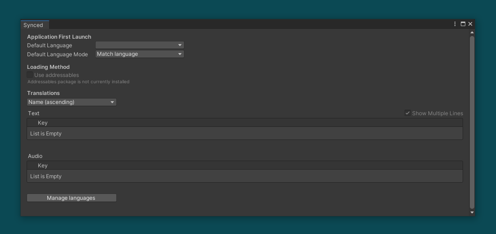
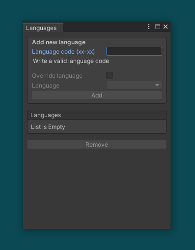
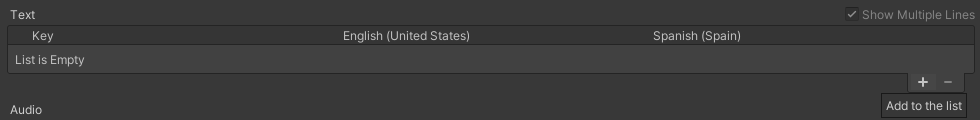
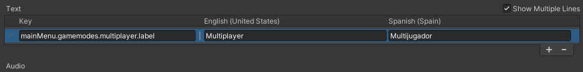
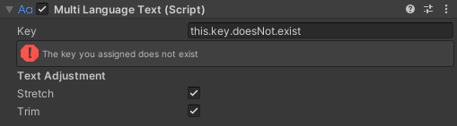
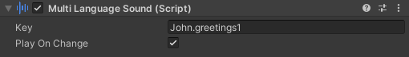
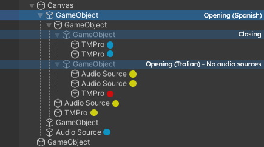
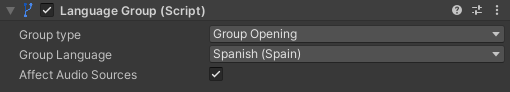
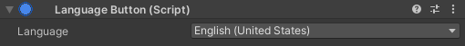

# *Synced* Documentation - [Version 1.0.0](CHANGELOG.md/#version-100-december-6-2023)
December 16, 2023

## Contents
- [Getting Started](#getting-started)
    * [Adding Languages](#adding-languages)
    * [First Launch Configuration](#first-launch-configuration)
    * [Managing Translations](#managing-translations)
- [Components](#components)
    * [MultiLanguageText](#multilanguagetext)
    * [MultiLanguageSound](#multilanguagesound)
    * [LanguageGroup](#languagegroup)
    * [LanguageButton](#language-button)
- [Compatibility](#compatibility)
    * [TextMeshPro](#textmeshpro)
    * [Addressables](#addressables)
- [Code Overview](#code-documentation)
    * [Properties](#properties)
    * [Events](#events)
    * [Methods](#methods)
- [Ending](#ending)
    * [The Future of *Synced*](#the-future-of-synced)
    * [Reporting Issues](#reporting-issues)
    * [Thank You!](#thank-you)

## Getting Started
Open the *Synced* settings window. For achieve this, go `Window > Synced > Settings`. You will see the following window:

\
*Settings Window.*

### Adding Languages
Click the *Manage Languages* button to add your first language. 
In the window that opens, you'll find several fields, but the only mandatory one is the **Language Code** text field. Input the ISO code for the desired language (la-RE for language-REGION). Just ensure the language exists and hasn't been implemented already.
The **Override Language** toggle allows you to base a new language on an existing one, copying its fields. For instance, if en-US already exists and you want to add en-UK, it's a good idea to use the same translations and modify only what's necessary.
> [!NOTE]
> The override option is only effective during language creation and won't impact future changes.

\
*Languages Window.*

### Managing Translations

#### Add
To begin adding translations, populate the text translations list by creating list items:

\
*When languages are added, the add and remove buttons should appear.*

#### Edit
Each text you added will appear as a field, accompanied by an additional one for the key. The key serves as a reference for the entire line of translations, and you can assign any value you prefer. Consider using a hierarchical key format for better organization.

> [!CAUTION]
> Each key has to be unique, so it mustn't be more than one translation with the same key (in each list)

> [!TIP]
> Not every text has to be a translation. Imagine writing addressables paths for various textures of a poster which contains texts you want to translate.

#### Special Characters
Next, input the translations for the languages you have implemented. If you need it, you can use placeholders. Placeholders allow you to translate texts with variable information, for example, a health message or the durability of a weapon. Placeholders are declared with `%p` in your translations, for example: "your current health is %p". Learn how to use placeholders by using the [GetText()](#gettext--getaudio) method.

\
*Example of a key translation.*

### First Launch Configuration
Once you have added the desired languages and translations, navigate back to the settings window to configure the initial language selection for the user's first app launch. This feature is essential for ensuring an optimal user experience by setting the most accurate language right from the app's first opening.

- **Match Language and Region** selects the exact language corresponding to the device's system language.
- **Match Language** chooses the language that best matches the device, permitting the app to select an alternative regional variant if the exact match is unavailable.
- **Use Default** always opts for the language set as the default.

\
*First launch settings.*

> In cases where a matching language is not found, the app will set default language.


## Components
*Synced* makes easier to work with the translations you added by some easy-to-use components which will do the main work without coding.

### MultiLanguageText

#### Overview
This component should be added to a GameObject containing either a `Text` or `TextMeshPro` component.
> [!WARNING]
> The package is optimized for TMPro, Unity's cutting-edge text display system, for the best experience. If you've installed TMPro, using the component with the Text component is not supported. This serves as an alternative for users who choose not to use TMPro in their projects but isn't the primary focus of the package.

#### Features & Usage
Simply input the desired key into the `Key` field. The package will automatically display the corresponding text using the attached `Text` / `TMPro` component. These are the features you may consider:
- The component utilizes *Synced* events to know when to automatically change the text, such as when altering the application language.
- If the input key doesn't exist, an error alert will be displayed, indicating the non-existent key. During gameplay, the text object will show `"Key ??"`.
- **[TMPro Only]** Explore the `Stretch` and `Trim` fields in the inspector. These options allow the script to adjust the rect dimensions to fit the text.

\
*Error displayed when the key does not exist. Also, the `Stretch` and `Trim` fields.*

### MultiLanguageSound

#### Overview
As with `MultiLanguageText`, this component has to be attached to a GameObject with a `AudioSource`. By the same way, you have to input the key to make the script automatically set the audio clip on the source.
> [!NOTE]
> Here, the keys you need to use are the ones which refers to audio clips in the audio translations list.

#### Features & Usage
- Note there is a new option named `Play On Change`. This property, when marked as true, will play the sound every time the clip is changed.
- The component overrides many `AudioClip` own methods, such as `Play()` or `Stop()`, which allows to perform these actions directly from the `MultiLanguageSound` component.

\
*MultiLanguageSound's Inspector.*

### LanguageGroup

#### Overview
Each multi-language object is overseen by a controller. In the absence of a designated controller, the application autonomously functions as a controller for all translatable objects. It governs language selection and other pertinent fields. In essence, this component, when attached to a GameObject, effectively manages child objects, enabling developers to establish "zones" where the language differs from the application's default, aligning with the controller's language setting.

\
*This chart, in which red represents Italian, blue English and yellow Spanish, shows how do language groups work in a scene where English is set as application language.*

#### Features & Usage
Simply attach the component to any GameObject, select a language for the group, and observe how child objects utilize that language, even if the application's language differs.
- Note the convenient picker to designate a group as closing, preventing language propagation within that object branch, reverting to the default language or parent group in nested scenarios.
- For opening groups: Disable `Affect Audio Sources` to exclude inner audio sources from responding to the controller.
- For closing groups: Activate `Close All` to close all nested groups, ensuring a return to the default application language.
- Utilize various methods from primary language management, such as `SetGroupLanguage()` or `RefreshTexts()`. The package has been designed to optimize method calls, ensuring that translatable objects are updated solely when their controller (whether it's the application or a language group) initiates the update.

\
*LanguageGroup's Inspector when set as group opening.*

### Language Button

#### Overview
Although is a very simple component, makes too much easier to design you settings language selector view. 

#### Features & Usage
You just have to attach it to a UI GameObject which is interactable (is raycast target). Then, choose the language you'd like to set as application language when pressing the button.
- When pressed, the button calls the `OnButtonPressed` event which you can use, for example, for changing the texture of the button.

\
*LanguageButton's Inspector*

## Compatibility

> [!IMPORTANT]
> Installing packages can produce some errors that may cause Synced not to recognise these packages. Follow this steps to solve it:
> 1. Press `Assets` in the toolbar and click `reimport all`. This will solve the issue the 90% of the times.
> 2. If the problem persists, do the following:
> *Synced* uses compilation symbols to let the components know how to behave. If by any reason they haven't been added automatically, you can write them by yourself. The compilation symbols you want to add are `TMPRO_PACKAGE_EXISTS` and `ADDRESSABLES_PACKAGE_EXISTS`. Make sure you add just the ones which matches with you current installed packages to avoid major issues.


*Synced* is crafted to seamlessly integrate with some of Unity's most popular solutions, ensuring a rich and flexible user experience. Keep in mind that the installation or removal of packages forces *Synced* to adapt itself to being able to work with the installed ones. This could produce compilation errors, but nothing to worry about. Typically, recompiling the scripts resolves these issues. If the problem persists, consider restarting the Unity editor.

### TextMeshPro

[TextMeshPro](https://docs.unity3d.com/Manual/com.unity.textmeshpro.html) stands out as the recommended text solution for *Synced* due to its tailored functionalities. However, for those who prefer an alternative, *Synced* also supports the legacy `Text` component, though with some sacrificed features.
> [!NOTE]
> Once the `TextMeshPro` package is installed, the use of legacy texts for translatable texts is no longer supported.

### Addressables

[Addressables](https://docs.unity3d.com/Manual/com.unity.addressables.html) significantly boosts data loading speed. By default, translations data is loaded using `Resources`, which might lead to longer project opening times when handling substantial data, especially with audio clips. While I strive to avoid limiting developers in their package choices, I highly recommend choosing Addressables over Resources.
Additionally, ensure that you have initialized Addressables by creating at least one addressable group. If your project was already utilizing Addressables, this step may have been completed. However, if you are installing Addressables specifically for *Synced*, be sure to perform this initialization step. This can be achievend marking any asset as addressable (you can unmark it later).

> [!NOTE] 
> In the editor, data is loaded directly from object references in the Assets folder, making the difference between the two solutions unnoticeable. Resources and Addressables are employed only in the built version.


## Code Documentation

### Introduction
*Synced* provides a multitude of tools for improving your language experience within your application. To achieve the best results, use these tools in conjunction with its extensive coding library. This combination allows for a heightened level of personalization in your project.

> [!IMPORTANT]
> When interacting with *Synced*'s language library, ensure you import the `Synced` namespace. All methods, properties and events belong to the `LanguageManager` static class, so be certain to reference it.

```csharp
using UnityEngine;
using Synced;

public class SomeBehavior : MonoBehaviour
{
    void Start() 
    {
        Debug.Log(LanguageManager.ApplicationLanguage);
    }
}
```

### Properties
| Property Name | Type       | Accessors | Description                                        |
|:-------------:|:----------:|:---------:|:--------------------------------------------------:|
| `AutoSavePreferences` | `bool` | `get` `set` | Whether the language auto-save between sessions has to be enabled. Note that this feature is only available on build |
| `DefaultLanguage` | `Language` | `get` | Returns the language set as the default. |
| `ApplicationLanguage` | `Language` | `get` | Returns the currently set application language. |
| `SupportedLanguages` | `Language[]` | `get` | Returns the list of languages available in the application. |

### Events
| Event Name | Event Info | Description |
|:----------:|:----------:|:-----------:|
| `OnApplicationLanguageChanged` | `LanguageChangedEvent` | Triggered when the application language is changed. |
| `OnRefresh` | `RefreshEvent` | Triggered when calling `Refresh()` manually or when the language changes. |
> Both events are available in language groups. Note that `OnApplicationLanguageChanged` is named `OnGroupLanguageChanged` within language groups.

### Methods
#### SetApplicationLanguage

Sets the language the application uses.
The method has two overloads. Both requires a language to be given, but using different formats: A `string` ISO code of the language or a `Language` object.
```csharp
LanguageManager.SetApplicationLanguage("en-US");
LanguageManager.SetApplicationLanguage(someLanguage);
```
*This method returns no value.*

> The method is also available within language groups, where it is called `SetGroupLanguage()`.

#### ResetToDefaultLanguage

This method sets the language to the default one. It is specifically designed for situations where you want to revert to the default language. Due to that, is the unique time it triggers the `LanguageChangedEvent` with the `SetAsDefault` field set to true.

```csharp
LanguageManager.ResetToDefaultLanguage();
```
*This method requires no arguments.*\
*This method returns no value.*

#### RefreshTexts

This method repaints the displayed text content by refreshing it based on the current language. It could be a good way to solve visual bugs when a text is not loading properly. It works by a optimal way, refreshing only the texts which are under the application language group controller.

```csharp
LanguageManager.RefreshTexts();
```
*This method requires no arguments.*\
*This method returns no value.*

> The method is also available within language groups and only refreshes the text which the group handles.

#### GetDeviceLanguage

Obtains the language the system uses and returns it as a `Synced.Language` class object.
```csharp
Language lang = LanguageManager.GetDeviceLanguage();
```
*This method requires no arguments.*


#### GetText & GetAudio
Both methods search into the translations dictionaries and returns the `string` / `AudioClip` which matches the given key.

There are 3 available overloads available. The first one only requires a `string` which represents the key of the translation you want to get.
```csharp
string translatedText = LanguageManager.GetText("mainMenu.gamemodes.multiplayer.label");
AudioClip translatedClip = LanguageManager.GetAudio("John.greetings1");
```

This overload returns the translation based on the application language. However, it also accepts either a `string` ISO language code or a `Language` object to get the translation in a specific language:
```csharp
string translatedText = LanguageManager.GetText("mainMenu.gamemodes.multiplayer.label", "es-ES");
string translatedText = LanguageManager.GetText("mainMenu.gamemodes.multiplayer.label", someLanguage);
AudioClip translatedClip = LanguageManager.GetAudio("John.greetings1", "es-ES");
AudioClip translatedClip = LanguageManager.GetAudio("John.greetings1", someLanguage);
```

`GetText()` allows you to give extra `string` params for being used as placeholder replacements. The order you write the params is very important. The first one will replace the first placeholder; the second one, the second placeholder...

```csharp
string translatedText = LanguageManager.GetText("mainMenu.gamemodes.multiplayer.label", "es-ES", "replacement1", "replacement2");
string translatedText = LanguageManager.GetText("mainMenu.gamemodes.multiplayer.label", someLanguage, "replacement1", "replacement2", "replacement3");
```

#### IsLanguageSupported & GetLanguageSupport
Both methods require a language to be given and have the same behavior: returns the sompatibility of a language in you application. The difference between them is the way they return the result: `IsLanguageSupported` returns a `bool`, while `GetLanguageSupport` is more precise, returning a `LanguageSupport` type value.

```csharp
bool isSupported = LanguageManager.IsLanguageSupprted("fr-FR");
bool isSupported = LanguageManager.IsLanguageSupprted(someLanguage);
LanguageSupport supportDetails = LanguageManager.GetLanguageSupport("fr-FR");
LanguageSupport supportDetails = LanguageManager.GetLanguageSupport(someLanguage);
```
`LanguageSupport` is a `enum` which can adopt 3 different values. You can use the `LanguageSupport` information to determine the availability of a language variant in your application by a more precise way:
- `LanguageSupport.Supported` = `0`: The exact language is available in the application.
- `LanguageSupport.HalfSupported` = `1`: The language exists, but not the given regional variant.
- `LanguageSupport.Unsupported` = `2`: There's no available variant of the language.


## Ending
### The Future Of *Synced*
Stay tuned for future updates and enhancements. I have planned some more updates to improve even more. After all, this tool is for you, so if you have any suggestion of implementation you'd like to be in synced, let me know.

### Reporting Issues
Due to the fact that this is the first version of the package, it could still present some bugs. If so, do not hesitate to report them [here](mailto:oscar30gt@gmail.com). I'm always trying to improve my projects and your help really helps me and makes you have a more fluent experience when working with Unity.

### Thank You!
Finally, I sincerely appreciate your consideration of *Synced* for your language management needs. Hope it helps you or your team in your projects! :D